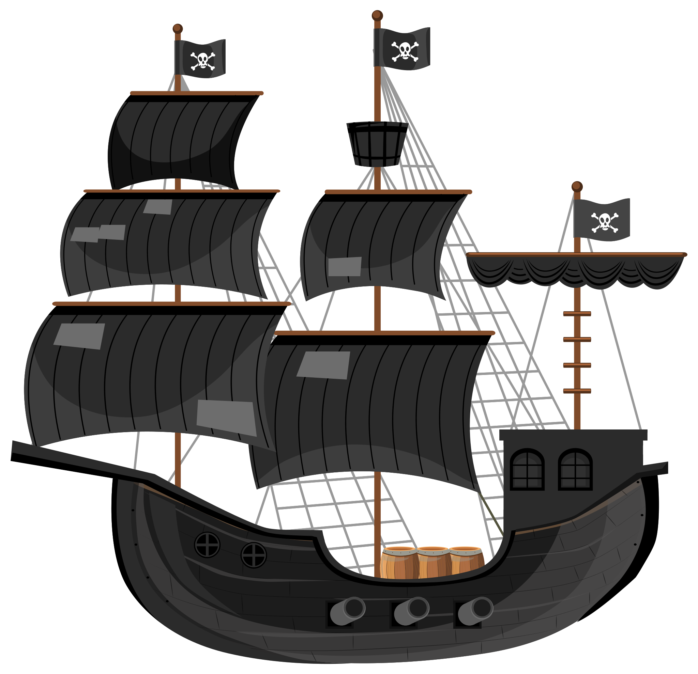

# Black Pearl 🏴‍☠️ [](https://www.paypal.com/cgi-bin/webscr?cmd=_donations&business=BKXUAMJSNZN46&item_name=Thanks+for+Help+me%21&currency_code=BRL&source=url)

<!-- Translate -->

[](./README-pt-br.md)

<!-- Banner -->

[](https://github.com/deppbrazil/black-pearl)

[](https://www.codacy.com/gh/deppbrazil/black-pearl/dashboard?utm_source=github.com&utm_medium=referral&utm_content=deppbrazil/black-pearl&utm_campaign=Badge_Grade)
[](https://github.com/deppbrazil/black-pearl)
[](./LICENSE)

## Get Started

### Setup, you need:

-   Nodejs `vs +12.0`
-   Yarn `vs 1.22.*`
-   Lerna `vs +3.0`

### Run in main directory

```console
foo@bar:~$ yarn
foo@bar:~$ yarn lerna bootstrap
```

### Run in /cli directory

```console
foo@bar:~$ yarn
foo@bar:~$ yarn link
foo@bar:~$ blackpearl -h
```

### Run in main directory to view Documentation with DOCZ

```console
foo@bar:~$ yarn start:docs
```

### Run for documentation deploy in AWS S3

```console
foo@bar:~$ blackpearl deploy docs
```

## Create components

### Run for create new component

```console
foo@bar:~$ blackpearl generate component NameComponent
```

### Always run when creating a new component

```console
foo@bar:~$ yarn
or,
foo@bar:~$ yarn lerna bootstrap
```

### Run a build

```console
foo@bar:~$ yarn build
```

### Run a unit tests for componentes

```console
foo@bar:~$ yarn test
```

* * *

Copyright © Mir Carvalho 2021
